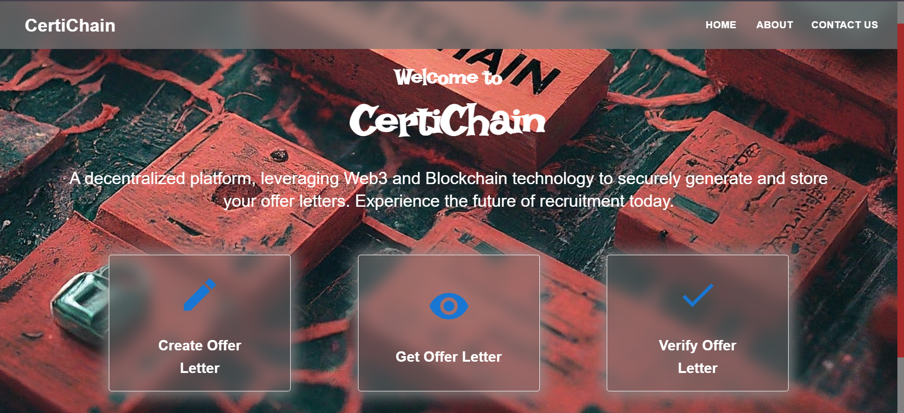
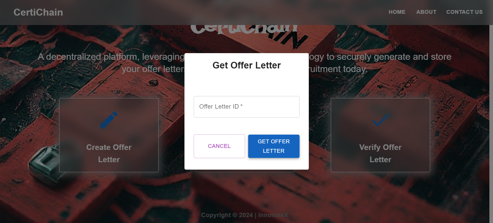
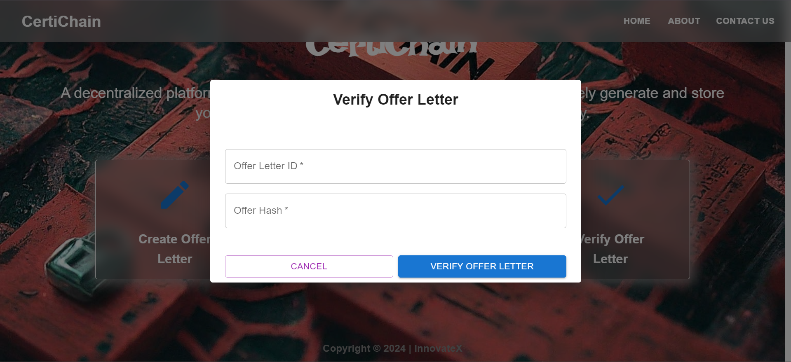

# CertiChain

CertiChain is a decentralized platform for creating and managing offer letters using blockchain technology. The platform leverages Ethereum smart contracts to ensure the authenticity and integrity of the offer letters. CertiChain provides a seamless interface for employers to create offer letters and for candidates to verify them.


## Table of Contents
- [Features](#features)
- [Prerequisites](#prerequisites)
- [Installation](#installation)
- [Running the Application](#running-the-application)
- [Smart Contract Deployment](#smart-contract-deployment)
- [Technologies Used](#technologies-used)

## Features
- **Decentralized Offer Letter Creation**: Create immutable and tamper-proof offer letters stored on the Ethereum blockchain.
- **Verification of Offer Letters**: Verify the authenticity of offer letters using the offer hash.
- **Unique URLs**: Each offer letter is assigned a unique URL for easy reference.

## Prerequisites
- Node.js and npm
- Ethereum wallet (e.g., MetaMask)
- Truffle (for smart contract deployment)
- Ganache (for local blockchain development)

## Installation

### Clone the Repository

```bash 
git clone https://github.com/yourusername/CertiChain.git
cd CertiChain
```


### Install Dependencies

```bash 
npm install
```


## Running the Application

### Start the React Application
1. Create a `.env` file in the root of the project and add your contract address:
    plaintext
    ```bash
    REACT_APP_CONTRACT_ADDRESS=<Your_Contract_Address>
    ```

2. Start the development server:
    ```bash 
    npm run start
    ```
    

The application will be available at `http://localhost:3000`.

### Smart Contract Deployment

1. Ensure Truffle and Ganache are installed:
    
    ```bash 
    npm install -g truffle ganache-cli
    ```
    

2. Start Ganache:
    
    ```bash 
    ganache-cli
    ```
    

3. Compile and deploy the smart contract locally:
    
    ```bash 
    truffle compile
    truffle migrate --reset
    ```
    

4. Copy the deployed contract address and update the `.env` file with this address.


5. Compile and deploy the smart contract on Avalanche Fuji C-Chain (using AVAX tokens):
    
    ```bash 
    truffle compile
    truffle migrate --network fuji
    ```


## Technologies Used
- **React**: Frontend framework for building user interfaces.
- **Redux**: State management for managing application state.
- **Material-UI**: UI library for React for building responsive and accessible components.
- **Ethers.js**: Library for interacting with the Ethereum blockchain.
- **Solidity**: Programming language for writing smart contracts.
- **Truffle**: Development environment and testing framework for Ethereum.
- **Ganache**: Personal blockchain for Ethereum development.
- **Vercel**: Hosting platform for deploying the application.
- **Avalanche**: Blockchain deployment on a global blockchain network

## Brief About CertiChain
CertiChain is a blockchain-based platform designed to bring transparency and security to the process of issuing and verifying offer letters. By leveraging the immutability of blockchain technology, CertiChain ensures that offer letters cannot be tampered with, providing both employers and candidates with a secure and trustworthy solution for employment offers.

### Main Features
- **Secure and Immutable Offer Letters**: Store offer letters on the blockchain to prevent any tampering or unauthorized modifications.
- **Unique Identification**: Each offer letter is assigned a unique ID and URL for easy access and verification.
- **Verification Mechanism**: Verify the authenticity of offer letters using cryptographic hashes.
- **User-Friendly Interface**: Simple and intuitive interface for creating and managing offer letters.

## Screenshots

### Home Page



### Create Offer Letter


### Get Offer Letter



### Verify Offer Letter


## License
This project is licensed under the Apache-2.0 License - see the [LICENSE](LICENSE) file for details.


<!-- ### Explanation
- *Features*: Describes the main functionalities of the CertiChain platform.
- *Prerequisites*: Lists the required software and tools to run the project.
- *Installation*: Provides steps to clone the repository and install dependencies.
- *Running the Application*: Instructions to start the React application and deploy the smart contract.
- *Technologies Used*: Lists the technologies and libraries used in the project.
- *Brief About CertiChain*: Provides an overview of the platform and its main features.
- *Screenshots*: Placeholder for screenshots to visually describe the application (you need to add actual screenshots in the screenshots folder). -->